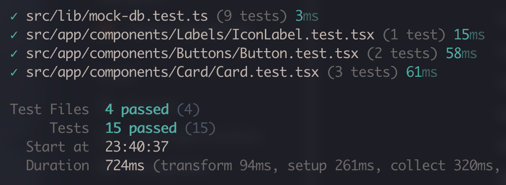
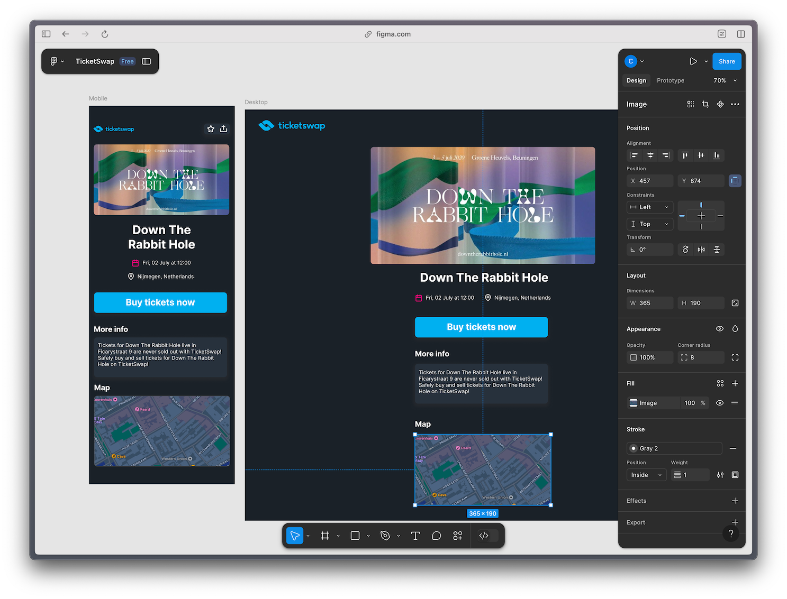

# TicketSwap Challenger

🔗 <a href="https://challenger-two.vercel.app" target="_blank">https://challenger-two.vercel.app</a>

This is an assessment project proposed by TicketSwap and developed by Carlos Zinato.

https://github.com/user-attachments/assets/43456d40-38e8-4a2b-bdcc-5efff03a0624

## Purpose of this project

The project delivers a user-friendly list of popular events, complete with detailed information. Users can filter the list using the search bar to find events by name or location. Each event detail page offers further information, a map for location context, and 'Favorites' and 'Share' buttons in the top bar. The application was built by the [@TicketSwap](https://github.com/TicketSwap) team using ReactJS, TypeScript, and Tailwind CSS. I expanded on the initial project by implementing several key features.

## Requirements

In order to run this app, I'm using the following tools and versions:

- NodeJS: 22.13.0
- npm: 10.9.2
- ReactJS: ^18
- vitest: ^3
- playwright: ^1.51

## Building

First clone or download this repository and in a terminal shell type:

```
$ npm install
```

Then run the app with

```
$ npm run dev
```

The app should be available at http://localhost:3000/

## Dependencies

Besides the dependencies already installed in the initial project I've added 4 new dependencies:

1. [Vitest](https://vitest.dev/) - for unit testing
2. [Playwright](https://playwright.dev/) - for E2E UI testing
3. [TomTom web-sdk-maps](https://developer.tomtom.com/maps-sdk-web-js/overview/product-information/introduction) and web-sdk-services

## Testing

Unit tests were added to the project using [Vitest](https://vitest.dev/) and [vitejs/plugin-react](https://www.npmjs.com/package/@vitejs/plugin-react) for React components testing. Some important test files include `./src/lib/mock-db.test.ts` and `./src/app/components/Card/Card.test.tsx`.
E2E UI tests were added using [Playwright](https://playwright.dev/). The test files can be found on `./e2e`.

In order to run the Unit Test, you can run the following command:

```
$ npm run test
```

A quick look on how the test results should look like:


If want to run the E2E tests with Playwright you can run the following command:

```
$ npm run test-e2e
```

A quick look on how the E2E results look like:


## Design

As one of the Challenger project's goals was to create the details screen for the events, I designed a mobile-first version in Figma, inspired by existing screens and components. Following the completion of the mobile prototype, I extended the design to a desktop view and subsequently started the implementation of these screens in code. Here's a screenshot of how the prototype looks like on Figma:  

