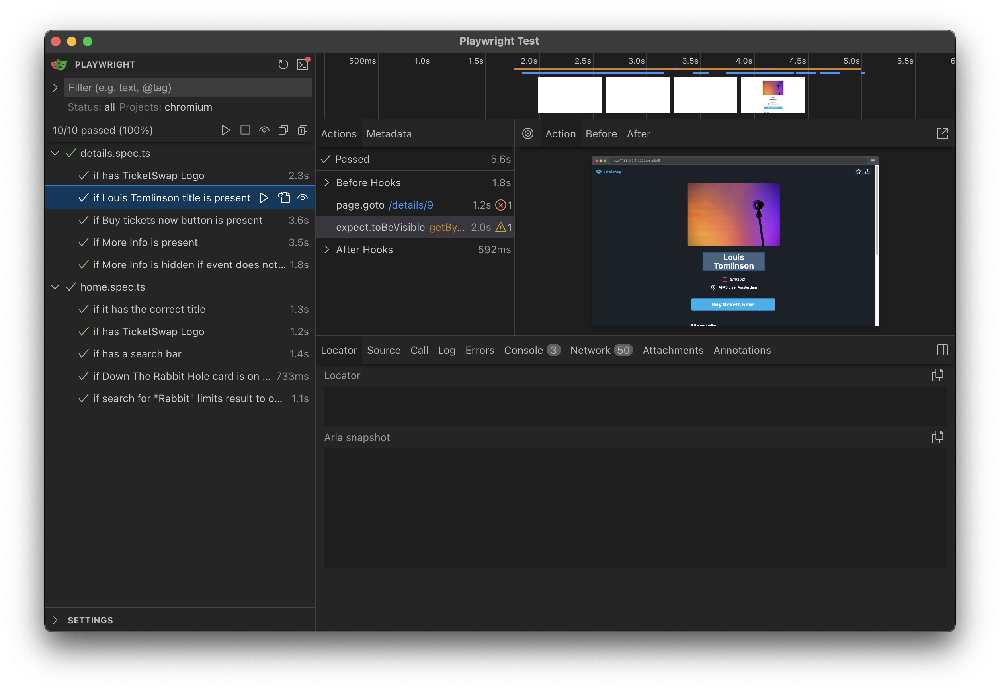

# TicketSwap Challenger

🔗 https://challenger-two.vercel.app

This is an assessment project proposed by TicketSwap and developed by Carlos Zinato.

https://github.com/user-attachments/assets/43456d40-38e8-4a2b-bdcc-5efff03a0624

## Purpose of this project

The idea of this project is to give the users a list of the most popular events and their details. The list contains a search bar that allows the user to filter the list of events by name or location. The details page contains more information about the event, a small map view showing the location of this event and a top bar with two buttons: favorites and share.
The application was created by the team [@TicketSwap](https://github.com/TicketSwap) using ReactJS, TypeScript and Tailwind CSS and I developed some additional features on top of the initial project.

## Requirements

In order to run this app, I'm using the following tools and versions:

- NodeJS: 22.13.0
- npm: 10.9.2
- ReactJS: ^18
- vitest: ^3
- playwright: ^1.51

## Building

First clone or download this repository and in a terminal shell type:

```
$ npm install
```

Then run the app with

```
$ npm run dev
```

The app should be available at http://localhost:3000/

## Dependencies

Besides the dependencies already installed in the initial project I've added 4 new dependencies:

1. [Vitest](https://vitest.dev/) - for unit testing
2. [Playwright](https://playwright.dev/) - for E2E UI testing
3. [TomTom web-sdk-maps](https://developer.tomtom.com/maps-sdk-web-js/overview/product-information/introduction) and web-sdk-services

## Testing

Unit tests were added to the project using [Vitest](https://vitest.dev/) and [vitejs/plugin-react](https://www.npmjs.com/package/@vitejs/plugin-react) for React components testing. Some important test files include `./src/lib/mock-db.test.ts` and `./src/app/components/Card/Card.test.tsx`.
E2E UI tests were added using [Playwright](https://playwright.dev/). The test files can be found on `./e2e`.

In order to run the Unit Test, you can run the following command:

```
$ npm run test
```

A quick look on how the test results should look like:


If want to run the E2E tests with Playwright you can run the following command:

```
$ npm run test-e2e
```

A quick look on how the E2E results look like:


## Design

Since one of the goals of the challenger project was to create a details screen with more information about the Popular Events, I took inspiration on the provided screens and components and started by designing a mobile-first details screen on Figma. With the mobile-first prototype done, I expanded it to a desktop view and started working on the implementation of those screens in the code. Here's a screenshot of how the prototype looks like on Figma:  

